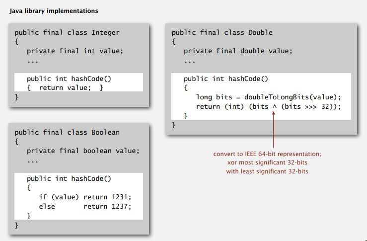

&emsp;&emsp;其实可以将hashTables和图书馆里找书相类比。下面是从quora上找的一段话。

>Imagine a very large library, many many shelves. You want to place books there in a special order so that they can be "found" fast every time without walking every shelf reading the titles (called searching).

>You take the title of the book, assign every letter a value and run a math formula on every one of those numbers to come up with a single value. That value is placed at the top of every shelf for it's range. You can go to a shelf straight away and set the book down. If you need to retrieve it later, you take the name of the book you want, run the same formula, get a number, go straight to the shelf and get it.

>This is called "perfect hashing" and it's the holy grail of hashing. That one book has a unique number (index) that always finds it. Generally hashing algorithms are graded by when you "accidentally" get the same number from two different books using your formula. You either expand the library so they don't overlap with more shelves to use, or you get a better formula with fewer duplicate hits.

-----[Answer from quora](http://www.quora.com/What-are-hash-tables-and-why-are-they-useful)

>No matter how good your hash function is, you cannot possibly make the hash table arbitrarily wide.  That would waste memory.  That implies that as the problem scales up, your hash buckets get deeper and deeper.  And you end up back at an O(n)/(# hash buckets) solution.

-----[Answer from quora](http://www.quora.com/What-should-every-programmer-know-about-hash-tables-and-hash-functions)

其实这里是说，当hashtables规模变得越来越大时，每一个bucket就变得越来越深，这个时候buckets是由linked list来架构的，所以即便按照key进行hash后找到了这个bucket，但是仍得在这个list里边去search，而这在hash table变得非常大的时候，非常不划算，之前看过一个视频讲的实际上hash table的时间复杂度是O(n/k),其中n是hash table的scale，而k则是buckets的个数，因此时间复杂度是O(n/k)，然后再加上每个list里的时间复杂度。因此这本质上还是O(n)的time complexity，所以上述答案建议当scale变得很大时，用tree。

但是紧接着该答案下的评论却又说：

>This answer is totally wrong. It looks like you assume that all hash tables have a small number of hash entries and that collisions are handled with linked lists that get very long. There are other way to implement hash tables without linked lists ([Double hashing](http://en.wikipedia.org/wiki/Double_hashing) for example).

介绍hash table的好视频。[Video from Youtube](https://www.youtube.com/watch?v=h2d9b_nEzoA)，但是这个只是入门介绍。更详细的还是得去听听<Algorithms>这门课。如下是相关笔记。

#Class 1

###1.Issues:

- Computing the hash function.
- Equality test:Method for checking whether two keys are equal.
- Collision resolution:Algorithm and data structure to handle two keys that hash to the same array index.Some ways to resolve collision.

然后老师讲到hash table是典型的space-time tradeoff.现实情况中是不会有无限制的空间和时间的，只能在这两者之间进行折中。

###2.Classic space-time tradeoff.

- No sapce limitation:trival hash function with key as index.
- No time limitation:trival collision resolution with sequential search.
- Space and time limitations:hashing(the real world),it means that we should find a suitable hash function and then handle the collision.

###3.Computing the hash function

**Idealistic goal.** Scramble the keys uniformly to produce a table index.

- Efficiently computable.
- Each table index eaqually likely for each key.

我个人的理解中，第一点无疑是为了节省计算hash function的时间。而第二点则是为了在一开始设定hash function的时候就尽量减少collision的可能性。比方说，如果hash出来的index某些值比另外一些值更有可能发生，那么这些更有可能产生的值就会更有可能出现collision的情况。

###4.Java’s hash code conventions

All Java classes inherit a method hashCode(),which return a 32-bit int.一般默认的返回值是Memory address of x.但是对象为integer,string,char,double,file等等时，便有特殊的处理方式了。

**Requirement**. If x.equals(y), then (x.hashCode() == y.hashCode()).

**Highly desirable**. If !x.equals(y), then (x.hashCode() != y.hashCode()).

也就是说，当两个对象相等时，要求其hashCode必须相等，这是必须的规定。并且尽量追求当两个对象不相等时，其hashCode不相等，但这并不是必须。这和我们找hash function是一个道理。因为一般情况下你无法避免collision。

这里有说到，将需要用到的每一个field用31x+y的形式连接起来，这点有些类似于上一张图。第二点，如果是基本类型的数据，则直接调用hashcode()函数，reference type的数据其实本质上有些类似于一个array，因而对其内每一个元素都用31x+y进行组合。

下面讲到hash code和hash function.这里实际上将hashing这个过程分成两个步骤，第一个步骤是hash code。也即是用一个32位的int类型数来代替原始数据，这也是上文讲到的hashCode()函数该干的事情。第二个步骤就是将上一步得到的32位int类型数进行映射到0~(M-1)的一个数，这个数就用来作为index。比如wikipedia里就有如下表述方式：

- Given a key, the algorithm computes an index that suggests where the entry can be found:

	index = f(key,array_size)

- Often this is done in two steps:

	hash = hashfunc(key)
	index = hash % array_size
	
所以，总结之，一般来说都有两个步骤，第一个步骤得到原始key的hash值，第二个步骤便是利用这个hash值进行映射，映射称为最终的index，然后再在这个index下存储相应的value。

上图中为什么会存在这些bug？首先hashCode()函数得到的是一个32位的int，因而是一个处于-2^31至2^31-1的整数。这个数有可能为负，因此进行求余操作后可能会得到负数，用这个作为index显然不行。（注意：Java中的负数进行求余会得到负数，但是python里似乎得到的是正数）那个1-in-a-billion bug 实际原因是当得到的hashcode是-2^31的时候，得到的绝对值已经无法用integer来表示了。integer的最大值是2^31-1，无法去表示-2^31.

- What's wrong with using (s.hashCode() % M) or Math.abs(s.hashCode()) % M to hash to a value between 0 and M-1?

- The % operator returns a non-positive integer if its first argument is negative, and this would create an array index out-of-bounds error. Surprisingly, the absolute value function can even return a negative integer. This happens if its argument is Integer.MIN_VALUE because the resulting positive integer cannot be represented using a 32-bit two's complement integer. This kind of bug would be excruciatingly difficult to track down because it would only occur one time in 4 billion! [ The String hash code of "polygenelubricants" is -2^31. ]

